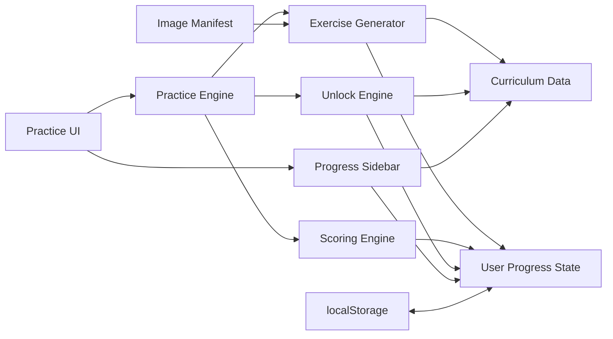
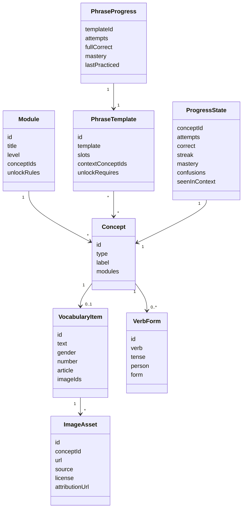
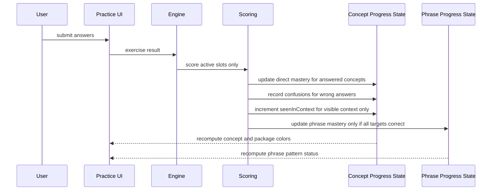

# Adaptive Italian Practice Engine

## Goal

Create a second Italian-learning site/module that turns the existing study material into an adaptive exercise engine. The engine should unlock vocabulary, module drills, phrase exercises, and global exercises gradually, while tracking active-recall mastery without corrupting scores through passive exposure.

The existing `index.html` study guide remains intact unless a later implementation slice explicitly integrates navigation between the guide and the new practice engine.

## User Request Coverage

- [x] Create a tracker with the whole plan.
  Resolution: this file records the product plan, execution strategy, stories, acceptance criteria, validation plan, and commit notes.

- [x] Include UML.
  Resolution: `UML / System Shape` contains Mermaid diagrams for components, data relationships, and scoring flow.

- [x] Include motivation.
  Resolution: `Motivation` explains why the engine exists and what learning problem it solves.

- [x] Include strategy.
  Resolution: `Implementation Strategy` and the story sections define phased delivery.

- [x] Include all context needed to understand the work.
  Resolution: `Context` and `Learning Model` summarize the conversation decisions and the existing app relationship.

- [x] Include decisions already made.
  Resolution: `Important Decisions Log` records the durable decisions.

- [x] Include what was decided not to do.
  Resolution: `Explicit Non-Goals / Not Doing` records the rejected or deferred approaches.

- [x] Include what else should be tracked.
  Resolution: this tracker also includes open questions, risks, validation, commit plan, data model, unlock model, scoring model, and resume notes.

## Scope Guardrails

- Do not create branches with the prefix `codex/`.
- Do not modify the current `index.html` guide while creating this tracker.
- Do not touch pre-existing untracked items unless the user explicitly asks.
- Do not add adjacent setup, refactors, API integrations, or workflow changes without approval.
- Do not implement live image search in the first engine slice.
- Do not put API keys or secrets in static HTML.
- Do not award mastery credit for visible prompt/context words.
- Do not use free-form sentence generation for the first version.
- Follow the repo AI governance docs summarized in `Documentation Dependencies`; this tracker intentionally duplicates the important constraints so implementation can proceed without tedious doc spelunking.

## Current Snapshot

- Date: 2026-05-06.
- Repo: `/Users/cicerohellmann/Projects/italian`.
- Current branch: `main`.
- Existing committed app: `index.html`, a static Italian guide with sidebar sections, quiz data, known dictionary, and verb panels.
- Pre-existing untracked paths observed before this tracker:
  - `AGENTS.md`
  - `docs/`
  - `.ai-governance-harness/`
- New tracker created: `adaptive_practice_engine_files.md`.
- Canonical product goal: adaptive Italian practice engine with mastery tracking and gradual unlocks.
- Existing tracker for this goal: none found before creation.

## Documentation Dependencies

This section intentionally references the repo documentation heavily so future implementers do not have to re-open every governance file before acting. If the docs change, update this tracker before implementation continues.

### Reading Order Source

From `docs/ai/README.md`, the repo-wide reading order is:

1. `AGENTS.md`
2. `docs/ai/README.md`
3. `docs/ai/ARCHITECTURE.md`
4. `docs/ai/PROJECT_MAP.md`
5. `docs/ai/VERIFICATION_CONTRACT.md`
6. `docs/ai/AI_ANSWER_CONTRACT.md`
7. `docs/ai/AI_CODE_REVIEW.md`

For this tracker, the essential implementation rules are copied below. Re-read the source docs only if there is a conflict, ambiguity, or governance-file change.

### Execution Path Rules

Source: `docs/ai/README.md`, `docs/ai/AI_ANSWER_CONTRACT.md`, `docs/ai/AI_REQUEST_TEMPLATE.md`.

- Exactly one path may be active: `Implementation`, `Review`, or `Checkpoint`.
- Implementation may edit docs/code/tests/assets, but must not silently include commit/push work.
- Review may inspect and report findings, but must not edit files.
- Checkpoint may stage/commit/push existing work, but must not add fresh implementation.
- Do not implement during Review.
- Do not commit or push during Implementation unless the user explicitly switches to Checkpoint.
- Do not add new implementation during Checkpoint.

For adaptive practice engine work:

- Building `mastery.html` is `Implementation`.
- Reviewing tracker/UML quality is `Review`.
- Committing the tracker or implementation after proof exists is `Checkpoint`.

### Ownership Boundaries

Source: `docs/ai/ARCHITECTURE.md`, `docs/ai/PROJECT_MAP.md`.

Targets currently documented by the repo:

- `Static Study App`
  - Paths: `index.html`
  - Owns Italian study UI, lesson content, grammar reference, quiz/practice behavior, client-side state, static styling, responsive layout.
  - Does not own AI governance policy/docs or publishing workflow.

- `AI Governance`
  - Paths: `.ai-governance-harness/`, `AGENTS.md`, `docs/ai/`
  - Owns repo-specific AI execution policy, implementation/review/checkpoint contracts, ownership map, verification rules, generated AI governance docs.
  - Does not own Italian study UI behavior, lesson content, or quiz scoring behavior.

Adaptive practice engine boundary:

- The planned `mastery.html` should be treated as part of the `Static Study App` product target, because it owns Italian practice behavior, client-side state, static UI, lesson/exercise content, and responsive layout.
- Do not modify `.ai-governance-harness/`, `AGENTS.md`, or `docs/ai/` while implementing the practice engine unless the user explicitly asks for governance-doc changes.
- If the implementation needs a shared area or split files, first explain which target needs it, why the current owner is insufficient, and why the shared location is stable enough to deserve shared ownership.

### Known Ambiguities To Avoid

Source: `docs/ai/PROJECT_MAP.md`.

- `app` usually means the static study UI in `index.html`; for this work, say `adaptive practice engine` or `mastery.html` explicitly.
- `website` could mean the existing guide or the new standalone page; this tracker selects a new standalone page first.
- `exercise` could mean quiz data, generated practice behavior, mastery scoring, or static lesson examples; implementation must name the exercise type being changed.
- `commit and push` is Checkpoint-path work only; do not add fresh implementation while checkpointing.

### Verification Requirements

Source: `docs/ai/VERIFICATION_CONTRACT.md`.

For `index.html`, required proof is:

- `script_syntax_check`
- `static_panel_reference_check`
- `manual_or_browser_smoke_for_ui_changes`

For `mastery.html`, use the same proof standard because it is a Static Study App page:

- script syntax check for embedded JavaScript;
- static reference check for modules/concepts/templates/exercise references;
- manual or browser smoke for UI changes when the UI is implemented;
- scoring invariant checks for mastery/exposure behavior, because that is core product logic.

Do not claim completion without proof matching the active path and target scope.

### Tracker Progression Rules

Source: `docs/ai/TRACKER_AND_PROGRESSION_RULES.md`.

- If tracked work changes progression, this tracker must move in the same change.
- Progress claims should include the smallest concrete proof that makes the claim reviewable.
- When an acceptance criterion becomes complete, update this tracker before ending the implementation slice.

### Answer / Handoff Requirements

Source: `docs/ai/AI_ANSWER_CONTRACT.md`.

Before editing during Implementation, declare:

- goal;
- validated requirement;
- files;
- ownership;
- boundaries;
- verification plan;
- tracker impact.

After editing, summarize:

- behavior;
- architecture compliance;
- files changed;
- verification gathered;
- cleanup;
- remaining review concerns.

### Decision Records

Source: `docs/ai/DECISION_RECORD_TEMPLATE.md`.

If a future choice changes architecture materially, record the decision here or in a dedicated decision record with:

- problem;
- validated intent;
- context;
- decision;
- why this decision;
- boundary impact;
- verification impact.

Examples that would deserve decision-record treatment:

- splitting `mastery.html` into multiple source files;
- adding a server;
- adding an image importer;
- changing from localStorage to another persistence layer;
- integrating Openverse/Pexels/Pixabay directly.

## Motivation

The current guide is good for reference, but it does not reveal what the learner can actively recall. The desired engine should behave more like Anki or Rosetta Stone, but at the exercise and phrase level:

- vocabulary can be practiced visually without relying on English first;
- grammar modules can be trained independently;
- phrases unlock only when the user knows enough building blocks;
- global exercises can combine vocabulary, prepositions, articles, verbs, and phrase patterns;
- mastery colors show what is painful, comfortable, or mastered;
- passive exposure is tracked separately so visible words do not become falsely "learned."

The key product value is a pain map: the learner can see whether the blocker is a word, an article, a preposition, a verb form, or a complete phrase pattern.

## Context

The existing study guide has these conceptual packages:

- Practice / Quiz
- Level 1 basics: phonetics, pronouns, articles, possessives, colors, numbers, useful phrases
- Level 2 foundations: prepositions, progressive with `stare + gerundio`, `essere`, `avere`
- Level 3 conjugations: regular `-are`, `-ere`, `-ire`
- Level 4 advanced: irregular verbs, reflexive verbs

The new engine should consume those same packages as curriculum data. The sidebar/menu should become a view over progress:

- each package has a mastery color based on active recall;
- each concept inside a package has its own state;
- phrase exercises depend on the readiness of their required concepts;
- global exercises can combine multiple packages after prerequisites are unlocked.

The engine should be implemented as a separate website/page first, likely `mastery.html`, rather than rewriting the current guide.

## Learning Model

### Mastery Categories

```text
Direct Mastery = what the user actively recalled.
Context Exposure = what the user saw but did not have to produce.
Phrase Mastery = whether every required blank in a phrase pattern was correct.
Package Mastery = aggregate active-recall mastery for concepts in a package.
```

### Hard Scoring Rule

```text
Only active recall changes mastery color.
Passive exposure never changes mastery color.
```

Visible context may increment:

```text
seenInContext += 1
```

But it must not make a word, module, or package greener.

### Partial Phrase Scoring Example

Prompt:

```text
Sono ____. Mi occupo soprattutto ____ app Android. E tu, che ____ ____?
```

Expected:

```text
sviluppatore software
di
lavoro
fai
```

User answer:

```text
Sono sviluppatore software.
Mi occupo soprattutto in app Android.
E tu, che lavoro fai?
```

Scoring:

```text
sviluppatore software = correct, mastery improves
di = wrong, confusion recorded as "in"
lavoro = correct, mastery improves
fai = correct, mastery improves
phrase pattern = not mastered
Sono / Mi occupo soprattutto / app Android / E tu / che = context exposure only
```

## Product Structure

### Exercise Layers

1. Vocabulary exercises
   - Rosetta Stone style image recognition.
   - Italian word to image.
   - Image to Italian typed answer.
   - Multiple image choice.

2. Module exercises
   - Focus one package at a time.
   - Examples: articles, possessives, prepositions, verb forms, progressive forms.

3. Phrase exercises
   - Use structured templates with blanks.
   - Unlock only when required modules/concepts are ready.
   - Score only the blanks.

4. Global exercises
   - Combine concepts from multiple modules.
   - Use known vocabulary and weak concepts to generate realistic mixed practice.

### Dynamic Generation

The generator should use known/unlocked vocabulary and grammar metadata, not random free-form generation.

Template example:

```js
{
  id: "work_intro_01",
  template: "Sono {profession}. Mi occupo soprattutto {prep} {topic}. E tu, che {noun} {verb}?",
  slots: [
    { key: "profession", conceptIds: ["sviluppatore-software"] },
    { key: "prep", conceptIds: ["di"] },
    { key: "noun", conceptIds: ["lavoro"] },
    { key: "verb", conceptIds: ["fare-presente-tu"] }
  ],
  contextConceptIds: ["essere-sono", "occuparsi", "app-android"]
}
```

The same template can generate different focused exercises:

```text
Sono ____.
____ sviluppatore software.
Mi occupo soprattutto ____ app Android.
E tu, che lavoro ____?
```

## Data Model Sketch

### Module

```js
{
  id: "prepositions",
  title: "Preposizioni",
  level: 2,
  conceptIds: ["di", "a", "da", "in", "con", "su", "per", "tra-fra"],
  unlock: { requires: ["articles"] }
}
```

### Concept

```js
{
  id: "di",
  type: "preposition",
  label: "di",
  meaning: "of",
  modules: ["prepositions", "known-dictionary"]
}
```

### Vocabulary Item

```js
{
  id: "germania",
  text: "Germania",
  type: "place",
  gender: "f",
  number: "singular",
  article: "la",
  prepositions: {
    liveIn: "in",
    comeFrom: "dalla"
  },
  modules: ["known-dictionary", "prepositions"]
}
```

### Progress State

```js
{
  conceptId: "di",
  attempts: 12,
  correct: 8,
  wrong: 4,
  streak: 3,
  mastery: 0.68,
  confusions: { "in": 3 },
  seenInContext: 21,
  lastPracticed: "2026-05-06T10:00:00.000Z"
}
```

### Phrase Progress State

Phrase mastery is tracked separately from individual concept mastery. Individual blanks update concept progress; the phrase template only improves when all required active targets are correct in the same attempt.

```js
{
  templateId: "work_intro_01",
  attempts: 5,
  fullCorrect: 2,
  mastery: 0.4,
  lastPracticed: "2026-05-06T10:10:00.000Z"
}
```

## UML / System Shape

### Component Diagram



### Data Relationship Diagram



### Scoring Flow



## Implementation Strategy

### Phase 1: Static Engine Shell

- Add `mastery.html`.
- Keep the first version self-contained.
- Mirror the original sidebar groups.
- Load hardcoded curriculum data in JavaScript.
- Persist progress in `localStorage`.

### Phase 2: Vocabulary And Module Exercises

- Implement vocabulary exercise modes first.
- Add simple local image manifest with curated fallback images or emoji placeholders.
- Implement focused module drills for articles, possessives, prepositions, and verb forms.

### Phase 3: Phrase Templates And Unlocks

- Add structured phrase templates.
- Add strict unlock rules based on concept readiness.
- Add phrase mastery independent from individual concept mastery.

### Phase 4: Dynamic Generation

- Fill templates from the user's known vocabulary.
- Prefer weak concepts, recent mistakes, and due concepts.
- Keep generation deterministic enough to debug.

### Phase 5: Image Import Workflow

- Add a separate importer or curation workflow for Openverse/Wikimedia.
- Store source, license, creator, and attribution metadata.
- Do not make live image search required during practice.

## Story 1: Create The Adaptive Practice Shell

**User story**
As a learner, I want a separate practice site that mirrors my study modules, so I can practice without losing the current reference guide.

### Acceptance Criteria

- [x] A separate `mastery.html` page exists.
  Implementation: create a self-contained static page with the same broad module groups as `index.html`; validate by opening the file or running static syntax checks.
  Result: `mastery.html` exists as a self-contained static adaptive practice shell with grouped curriculum data and no runtime dependencies.

- [x] The original `index.html` guide remains behaviorally unchanged.
  Implementation: avoid editing `index.html` in the first implementation slice unless the user explicitly asks for cross-linking.
  Result: Story 1 did not edit `index.html`; `git diff -- index.html` is empty.

- [x] The sidebar shows package state markers.
  Implementation: render package markers from computed package mastery, initially using default gray/unseen state.
  Result: `mastery.html` renders 17 packages with computed `unseen` markers and 0% package mastery on a fresh local state.

## Story 2: Track Active Recall Without Passive Mastery Credit

**User story**
As a learner, I want mastery colors to reflect what I recalled, not what I merely saw, so the app does not lie about what I know.

### Acceptance Criteria

- [x] Progress state separates direct attempts from passive context exposure.
  Implementation: define state fields for attempts/correct/wrong/streak/mastery/confusions/seenInContext; validate with a scoring unit harness or browser console test.
  Result: `mastery.html` now stores normalized concept progress with `attempts`, `correct`, `wrong`, `streak`, `mastery`, `confusions`, `seenInContext`, and `lastPracticed`, plus separate phrase progress for all-correct phrase attempts.

- [x] Visible prompt words never increase mastery.
  Implementation: scoring must only update mastery for answer targets; context concepts only increment `seenInContext`.
  Result: the pure scoring harness records context exposure separately and leaves context-concept mastery at `0`.

- [x] Wrong answers record confusions.
  Implementation: when expected `di` receives `in`, record `confusions.in += 1` on `di`.
  Result: the scoring fixture records `confusions.in === 1` and `wrong === 1` for concept `di`.

## Story 3: Add Vocabulary Exercises With Image Support

**User story**
As a learner, I want Rosetta Stone style image vocabulary exercises, so I can associate Italian words with meaning without translating through English.

### Acceptance Criteria

- [x] Vocabulary exercises support image-to-word and word-to-image modes.
  Implementation: create exercise generators for multiple-choice image cards and typed answers.
  Result: `mastery.html` now renders `Word -> Image` multiple-choice cards and `Image -> Word` typed prompts for packages with vocabulary image assets.

- [x] Image data comes from a manifest.
  Implementation: define image assets with `conceptId`, URL, source, license, and attribution fields; use local fallback images/placeholders for first version.
  Result: `VOCABULARY_IMAGE_MANIFEST` defines placeholder image assets with `conceptId`, `url`, `source`, `license`, and `attributionUrl`, and `window.CURRICULUM.imageAssets` exports the same manifest for static validation.

- [x] Live image search is not required during practice.
  Implementation: practice engine consumes the manifest only; future import workflow can update the manifest separately.
  Result: Story 3 uses local manifest entries only and performs no runtime image search or external fetches.

## Story 4: Add Focused Module Exercises

**User story**
As a learner, I want targeted drills for each module, so I can isolate weak areas like articles, prepositions, possessives, or verbs.

### Acceptance Criteria

- [ ] Article, possessive, preposition, and verb drills exist.
  Implementation: add module-specific exercise blueprints and score only the generated target slot.

- [ ] Module mastery colors aggregate active recall only.
  Implementation: compute package color from child concept mastery; ignore passive exposure in the calculation.

- [ ] Module filters let the user practice one package at a time.
  Implementation: add UI controls for all packages and specific packages.

## Story 5: Add Phrase Exercises With Unlock Rules

**User story**
As a learner, I want phrase exercises to unlock only when I know enough building blocks, so the app asks for sentences I can realistically construct.

### Acceptance Criteria

- [ ] Phrase templates declare required concepts.
  Implementation: add `unlockRequires` to each phrase template.

- [ ] Locked phrases remain unavailable until prerequisites are ready.
  Implementation: start with strict unlocks where all required concepts are at least `learning`.

- [ ] Phrase mastery updates only when every target blank is correct.
  Implementation: score individual blanks separately; update phrase pattern mastery only on all-correct attempts.

## Story 6: Add Dynamic Exercise Generation From Known Vocabulary

**User story**
As a learner, I want exercises generated from the words I know, so practice grows naturally with my vocabulary.

### Acceptance Criteria

- [ ] Templates can fill slots from known vocabulary pools.
  Implementation: use concept metadata such as type, gender, number, article, and preposition behavior to fill compatible slots.

- [ ] The generator prefers pain points.
  Implementation: weight candidates by low mastery, recent mistakes, due status, and unlock relevance.

- [ ] The same phrase template can target different modules.
  Implementation: support blank-selection strategies so a phrase can test vocabulary, prepositions, verb forms, or mixed global recall.

## Story 7: Add Image Import And Curation Later

**User story**
As a maintainer, I want to pull candidate images from free/open sources and curate them, so vocabulary exercises use good images with correct attribution.

### Acceptance Criteria

- [ ] Openverse is the first planned source.
  Implementation: design importer around Openverse metadata and license fields.

- [ ] Wikimedia Commons is the fallback planned source.
  Implementation: document metadata shape compatible with Wikimedia results.

- [ ] Pexels/Pixabay are optional and require explicit API-key/terms decisions.
  Implementation: keep them out of the default first version.

## Important Decisions Log

- [x] 2026-05-06: Build a second website/page first, likely `mastery.html`, rather than rewriting `index.html`.

- [x] 2026-05-06: Use curriculum data plus a practice engine, so modules and sidebar state are data-driven instead of hardcoded practice behavior.

- [x] 2026-05-06: Use custom structured templates, not free-form AI sentence generation.

- [x] 2026-05-06: Use active recall only for mastery colors.

- [x] 2026-05-06: Track passive exposure separately as metadata only.

- [x] 2026-05-06: Phrase mastery only improves when all required blanks in the phrase are correct.

- [x] 2026-05-06: Dynamic exercises should use known/unlocked vocabulary and grammar metadata.

- [x] 2026-05-06: Phrase exercises unlock only when the prerequisite concepts/modules are sufficiently learned.

- [x] 2026-05-06: Use an image manifest during practice. Live image search is an import/curation concern, not a runtime dependency.

- [x] 2026-05-06: Prefer Openverse for free/open images, with Wikimedia Commons as fallback. Pexels/Pixabay remain optional.

## Explicit Non-Goals / Not Doing

- Do not integrate GF, SimpleNLG, H5P, Moodle Cloze, or raw Tracery in the first version.
- Do not build a full linguistic grammar engine before the smaller template engine proves useful.
- Do not use free-form AI to generate production exercises.
- Do not award mastery credit for hardcoded prompt/context words.
- Do not let passive exposure make a concept or package greener.
- Do not depend on live image search during every exercise.
- Do not store API keys in static HTML.
- Do not replace the current study guide as part of the first implementation.
- Do not add collaboration, accounts, or server persistence yet.

## Open Questions

- Should unlock thresholds start strict (`all prerequisites >= learning`) or allow a softer rule later (`80% learning, none unknown`)?
- Should phrase mastery decay over time, or only concept mastery?
- Should mastery use a simple ratio/streak model first or a spaced-repetition ease model?
- Should the first image version use emoji placeholders, curated public image URLs, or locally downloaded assets?
- Should `mastery.html` link back to `index.html`, or remain completely standalone until the engine stabilizes?
- What exact color scale should be used for package and concept markers?

## Risks

- Bad image choices can teach wrong associations.
  Mitigation: use curated manifest entries, not blind search results.

- Dynamic templates can produce unnatural Italian if metadata is too thin.
  Mitigation: start with small hand-authored templates and add metadata slowly.

- Mastery can become misleading if exposure leaks into scoring.
  Mitigation: keep scoring functions explicit and test active targets vs context targets.

- Unlock rules can become frustrating if too strict.
  Mitigation: start strict for correctness, then tune based on use.

- Single-file growth can become hard to maintain.
  Mitigation: structure JavaScript internally by data/engine/state/UI even if first delivered as one static file.

## Validation

- [x] Confirmed no existing `*_files.md` tracker for this goal before creating this file.
  Result: `rg --files -g '*_files.md'` found none on 2026-05-06.

- [x] Confirmed current branch.
  Result: `git branch --show-current` returned `main`.

- [x] Read and embedded implementation-relevant repo documentation.
  Result: summarized `docs/ai/README.md`, `ARCHITECTURE.md`, `PROJECT_MAP.md`, `VERIFICATION_CONTRACT.md`, `TRACKER_AND_PROGRESSION_RULES.md`, `AI_ANSWER_CONTRACT.md`, `AI_REQUEST_TEMPLATE.md`, and `DECISION_RECORD_TEMPLATE.md` in `Documentation Dependencies` on 2026-05-06.

- [x] Validate future `mastery.html` JavaScript syntax.
  Implementation requirement: keep curriculum/scoring test exports DOM-free, or guard browser bootstrapping so it does not run when `document` is unavailable.
  Planned command:
  ```sh
  node -e "const fs=require('fs'); const s=fs.readFileSync('mastery.html','utf8'); const scripts=[...s.matchAll(/<script[^>]*>([\\s\\S]*?)<\\/script>/g)].map(m=>m[1]); scripts.forEach((code,i)=>{ new Function(code); console.log('script '+(i+1)+' syntax ok'); }); if(!scripts.length) throw new Error('no inline scripts found');"
  ```
  Expected result: one `script N syntax ok` line per inline script and exit code `0`.
  Result: `script 1 syntax ok` on 2026-05-06.

- [x] Validate static module references.
  Implementation requirement: expose `window.CURRICULUM` without requiring DOM access at script load. If UI bootstrapping needs browser APIs, wrap it behind `if (typeof document !== 'undefined')` or provide explicit Node stubs.
  Planned command:
  ```sh
  node -e "const fs=require('fs'); const s=fs.readFileSync('mastery.html','utf8'); const scripts=[...s.matchAll(/<script[^>]*>([\\s\\S]*?)<\\/script>/g)].map(m=>m[1]).join('\\n'); const window={localStorage:{getItem(){return null},setItem(){},removeItem(){}}}; const document={addEventListener(){},querySelector(){return null},querySelectorAll(){return []},getElementById(){return null}}; new Function('window','document', scripts)(window,document); const c=window.CURRICULUM; if(!c) throw new Error('missing window.CURRICULUM'); const modules=new Set(c.modules.map(m=>m.id)); const concepts=new Set(c.concepts.map(x=>x.id)); const badModuleConcepts=c.modules.flatMap(m=>(m.conceptIds||[]).filter(id=>!concepts.has(id)).map(id=>m.id+'=>'+id)); const badTemplateConcepts=(c.phraseTemplates||[]).flatMap(t=>[...(t.unlockRequires||[]),...(t.contextConceptIds||[]),...(t.slots||[]).flatMap(s=>s.conceptIds||[])].filter(id=>!concepts.has(id)).map(id=>t.id+'=>'+id)); if(badModuleConcepts.length||badTemplateConcepts.length) throw new Error([...badModuleConcepts,...badTemplateConcepts].join('\\n')); console.log('static curriculum references ok');"
  ```
  Expected result: `static curriculum references ok` and exit code `0`.
  Result: `static curriculum references ok` on 2026-05-06.

- [x] Validate scoring invariants.
  Implementation requirement: expose `window.__TEST__.scoreFixture()` as a pure scoring fixture that does not require DOM, timers, network, image loading, or user events. The fixture must simulate one wrong phrase blank and return explicit booleans for the invariants.
  Planned command:
  ```sh
  node -e "const fs=require('fs'); const s=fs.readFileSync('mastery.html','utf8'); const scripts=[...s.matchAll(/<script[^>]*>([\\s\\S]*?)<\\/script>/g)].map(m=>m[1]).join('\\n'); const window={localStorage:{getItem(){return null},setItem(){},removeItem(){}}}; const document={addEventListener(){},querySelector(){return null},querySelectorAll(){return []},getElementById(){return null}}; new Function('window','document', scripts)(window,document); if(!window.__TEST__||!window.__TEST__.scoreFixture) throw new Error('missing scoreFixture test hook'); const r=window.__TEST__.scoreFixture(); if(!r.activeOnly) throw new Error('context changed mastery'); if(!r.confusionRecorded) throw new Error('confusion not recorded'); if(r.phraseMastered) throw new Error('phrase mastered despite wrong blank'); if(!r.allAnswersScored) throw new Error('later blanks did not score after an earlier miss'); if(!r.zeroTargetRejected) throw new Error('zero-target phrase received credit'); console.log('scoring invariants ok');"
  ```
  Expected result: `scoring invariants ok` and exit code `0`.
  Result: `scoring invariants ok` on 2026-05-06, including checks for later-blank scoring after an earlier miss and zero-target phrase rejection.

- [x] Browser smoke future `mastery.html`.
  Planned manual steps:
  1. Open `mastery.html` in a browser.
  2. Confirm the page renders without console errors.
  3. Confirm sidebar package markers render in default/gray state on a fresh profile.
  4. Complete one available exercise when exercises exist.
  5. Confirm only answered targets change mastery color; visible context gets exposure metadata only.
  Expected result: no console errors, visible sidebar markers, and scoring behavior matching the active-recall invariant.
  Result: Firefox headless screenshot generated `/tmp/italian-mastery-story1.png` on 2026-05-06. Story 1 shell renders with visible sidebar markers in the default gray/unseen state; exercise submission and scoring smoke remain not applicable until exercise UI exists.

## Commit Plan

- Current tracker-only slice:
  - File: `adaptive_practice_engine_files.md`
  - Intent: durable planning artifact only.
  - Commit status: not committed yet.

- Future implementation slice 1:
  - File: `mastery.html`
  - Intent: static shell, curriculum data, localStorage state, basic sidebar.

- Future implementation slice 2:
  - File: `mastery.html` or split files if approved.
  - Intent: vocabulary/module exercises and scoring.

- Future implementation slice 3:
  - File: `mastery.html` or split files if approved.
  - Intent: phrase templates, unlocks, dynamic generation.

## Resume Notes

On resume:

1. Re-read this tracker first.
2. Use `Documentation Dependencies` as the embedded repo-doc handoff. Only re-open `docs/ai/*` if the docs changed, there is a conflict, or a future task explicitly changes governance.
3. Refresh `git status --short` and preserve unrelated local changes.
4. Declare the active execution path: Implementation, Review, or Checkpoint.
5. If implementing, start with Story 1 and do not broaden into image importing or server persistence.
6. Keep the scoring invariant central: active recall affects mastery; passive exposure does not.
7. Update this tracker after each completed acceptance criterion before committing.
