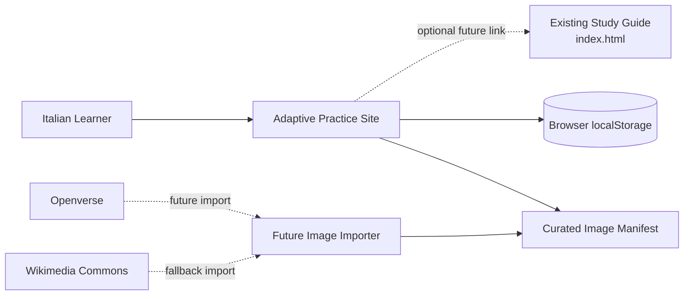
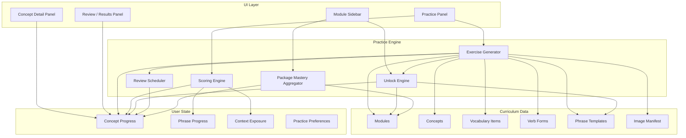
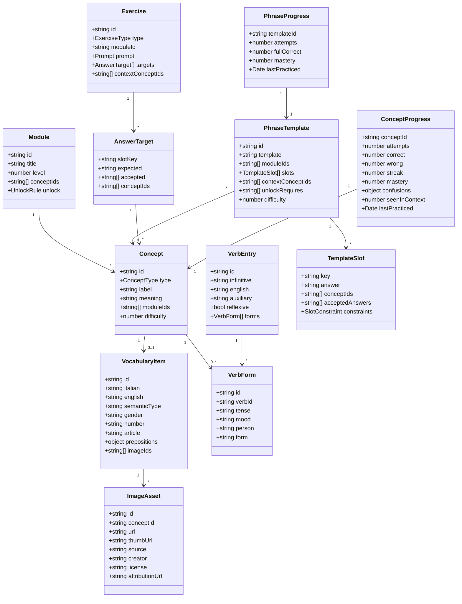
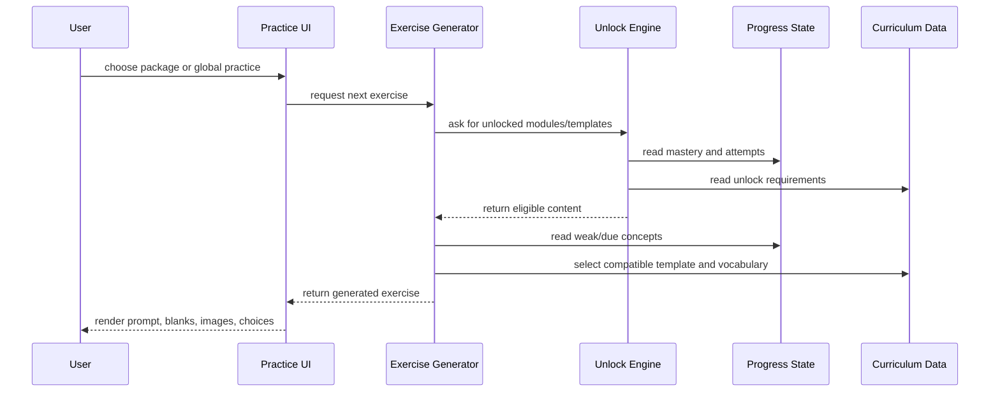
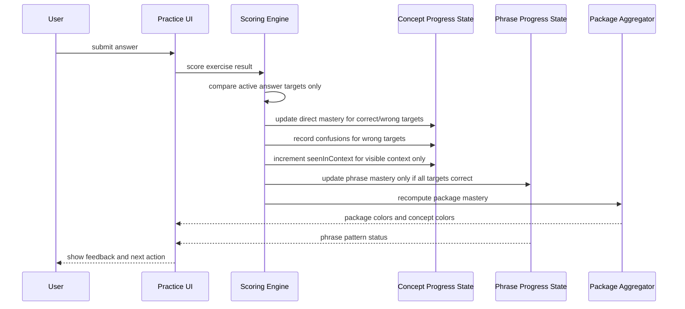
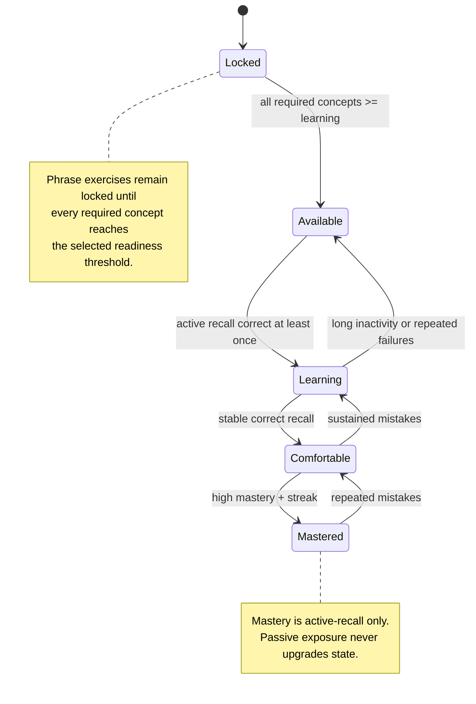
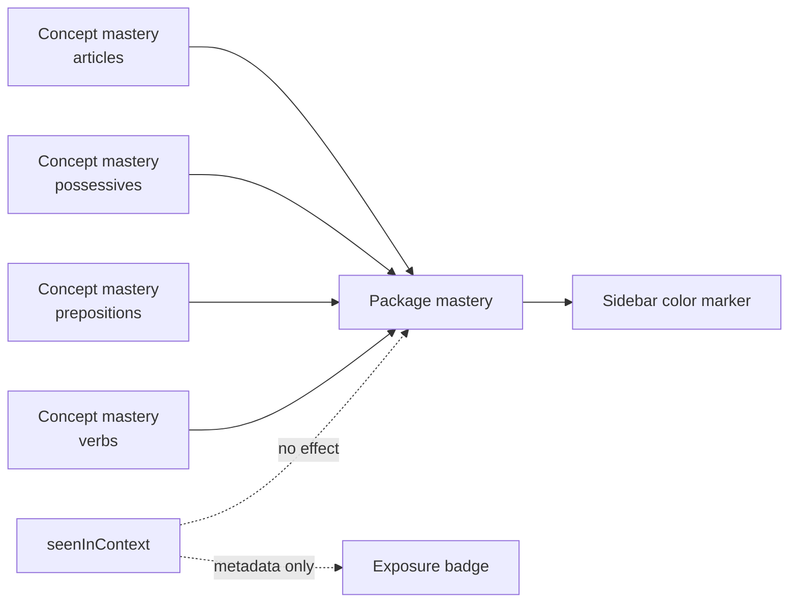
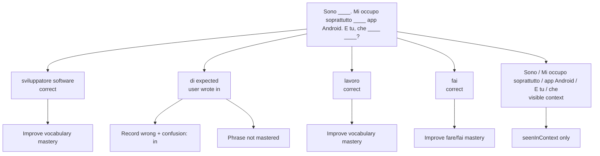
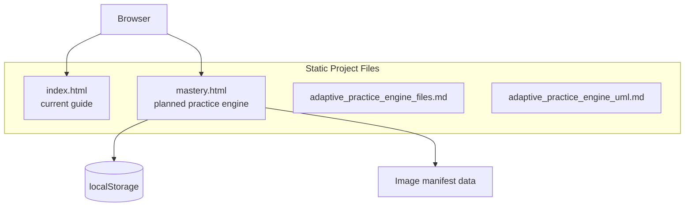
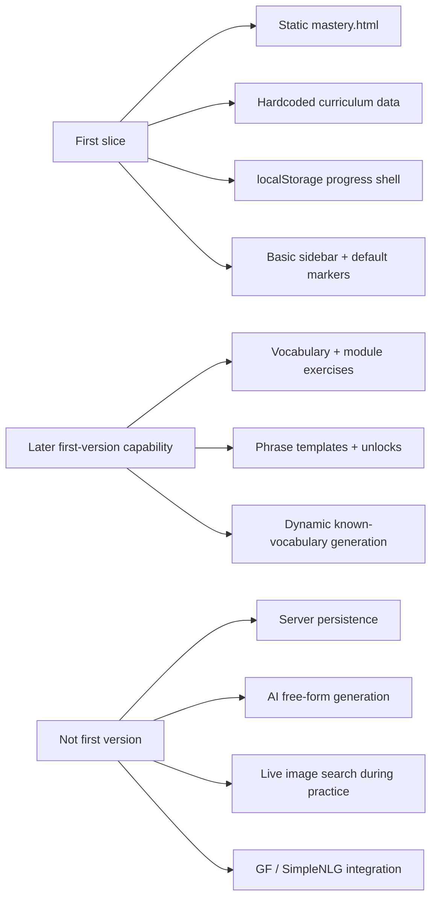

# Adaptive Italian Practice Engine UML

This UML document describes the planned adaptive practice engine as a separate site/module that consumes Italian curriculum data, generates exercises, tracks active-recall mastery, and unlocks harder content over time.

## System Context

## Component Diagram

## Class Diagram

## Exercise Generation Sequence

## Scoring Sequence

## Unlock State Machine

## Package Mastery Aggregation

## Phrase Exercise Scoring Example

## Deployment / Runtime View

## Implementation Boundary

The first slice must match the tracker: static shell, curriculum data, localStorage state, and basic sidebar only. Exercises and phrase unlocks are later first-version capabilities, not first-slice work.

